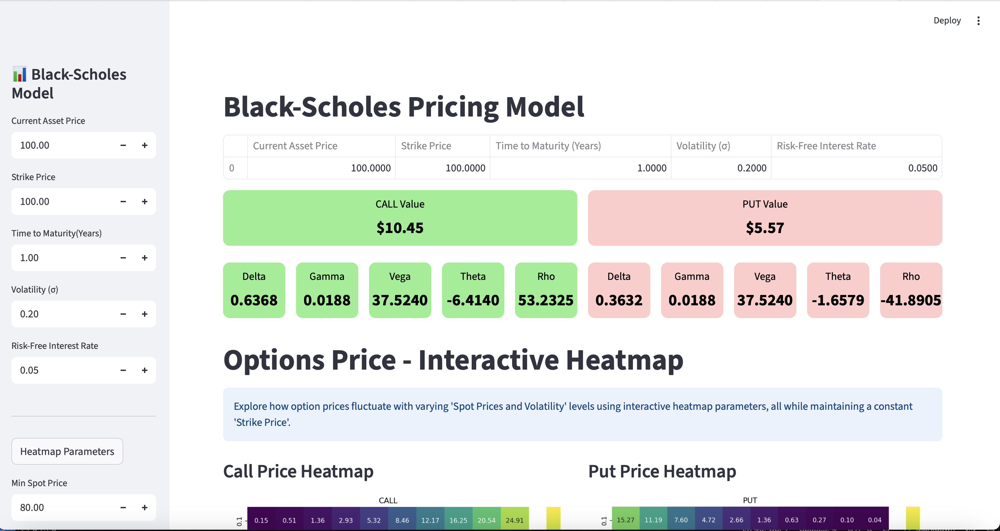
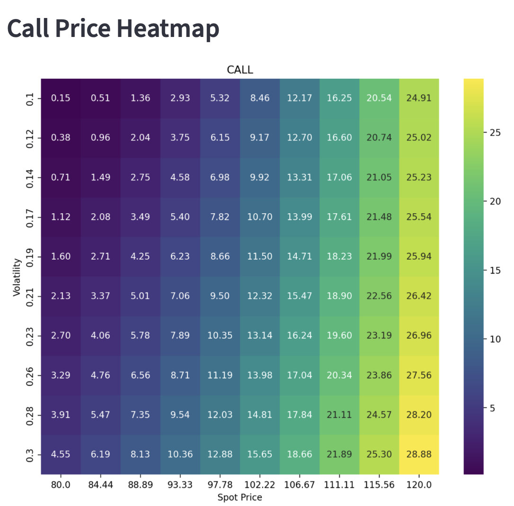
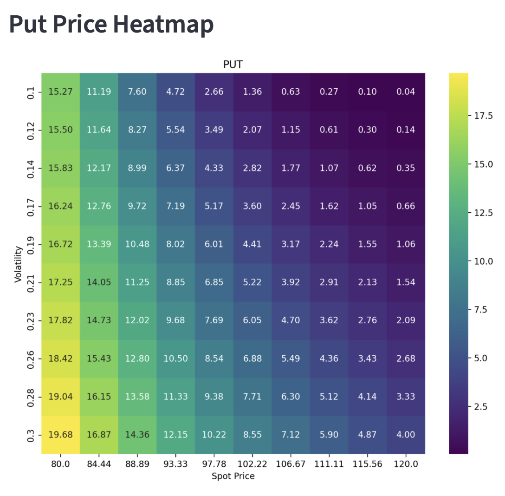

# Black-Scholes Option Pricing Streamlit App  

This project implements a **Black-Scholes Option Pricing Model** using **Streamlit**.  
It allows users to input asset parameters, calculate option prices (Call & Put), display Greeks, and visualize price sensitivity through heatmaps.  

---

## 📂 Project Structure  
- `app.py` → Streamlit app code  
- `requirements.txt` → Python dependencies  
- `images/` → Folder containing screenshots and heatmaps  

---

## ⚙️ Setup  

### 1. Clone Repository  
```bash
git clone https://github.com/Sanchay-01/Finance_Projects.git
cd Finance_Projects
```
### 2. Navigate to the BSM App Folder
```bash
cd "Black-Scholes-App"
```
### 3. Create Virtual Environment
```bash
python3 -m venv BSM
source BSM/bin/activate
```

### 4. Install Dependencies
```bash
pip install streamlit pandas numpy matplotlib seaborn plotly scipy
```
### 5. Run the App
```bash
streamlit run app.py
```

## 📐 Mathematical Theory

### 1. Black-Scholes Option Pricing Formula

The **Black-Scholes formula** calculates the theoretical price of European call and put options:

**Call Option Price:**

$$
C = S_0 \, N(d_1) - K e^{-rT} N(d_2)
$$

**Put Option Price:**

$$
P = K e^{-rT} N(-d_2) - S_0 N(-d_1)
$$

Where:

$$
d_1 = \frac{\ln(S_0 / K) + \left(r + \frac{\sigma^2}{2}\right)T}{\sigma \sqrt{T}}, \quad
d_2 = d_1 - \sigma \sqrt{T}
$$

* $C$ = Call option price
* $P$ = Put option price
* $S_0$ = Current asset price
* $K$ = Strike price
* $T$ = Time to maturity (in years)
* $r$ = Risk-free interest rate
* $\sigma$ = Volatility of the underlying asset
* $N(x)$ = Cumulative distribution function of the standard normal distribution

---

### 2. Option Greeks

Option Greeks measure sensitivity of option price to various factors:

| Greek         | Definition                                                    | Formula                                                                                                                                                           |
| ------------- | ------------------------------------------------------------- | ----------------------------------------------------------------------------------------------------------------------------------------------------------------- |
| **Delta (Δ)** | Rate of change of option price w\.r.t underlying asset price  | $\Delta_{call} = N(d_1), \quad \Delta_{put} = N(d_1) - 1$                                                                                                         |
| **Gamma (Γ)** | Rate of change of Delta w\.r.t underlying asset price         | $\Gamma = \frac{N'(d_1)}{S_0 \sigma \sqrt{T}}$                                                                                                                    |
| **Theta (Θ)** | Rate of change of option price w\.r.t time                    | $\Theta_{call} = -\frac{S_0 N'(d_1) \sigma}{2 \sqrt{T}} - r K e^{-rT} N(d_2)$, <br> $\Theta_{put} = -\frac{S_0 N'(d_1) \sigma}{2 \sqrt{T}} + r K e^{-rT} N(-d_2)$ |
| **Vega (ν)**  | Rate of change of option price w\.r.t volatility              | $\text{Vega} = S_0 N'(d_1) \sqrt{T}$                                                                                                                              |
| **Rho (ρ)**   | Rate of change of option price w\.r.t risk-free interest rate | $\rho_{call} = K T e^{-rT} N(d_2), \quad \rho_{put} = -K T e^{-rT} N(-d_2)$                                                                                       |

> Here, $N'(d_1)$ is the **standard normal probability density function** at $d_1$.

---

### 3. Notes

* These formulas apply **only for European options** (can be exercised at maturity).
* The Greeks help traders **hedge risks** and understand how option prices react to market changes.


## 📊 App Features
### 1. User Inputs
Current Asset Price
Strike Price
Time to Maturity (Years)
Volatility (σ)
Risk-Free Interest Rate (r)
### 2. Call & Put Option Values
The app displays:
Option Prices (Call & Put)
Greeks (Delta, Gamma, Vega, Theta, Rho)
📸 App Screenshot:

### 3. Interactive Heatmaps
Explore how option prices fluctuate with varying Spot Prices and Volatility while keeping the Strike Price constant.
#### Call Price Heatmap:

#### Put Price Heatmap:


## ⚡ Usage
* Adjust the sliders and input fields in the sidebar.
* Click “Heatmap Parameters” to generate interactive price heatmaps.
* Visualize how option values change with market conditions.

## 🚀 Future Improvements
* Add Monte Carlo simulations for option pricing.
* Include American Options support.
* Enhance the heatmap interactivity with Plotly.

## 📝 License
This project is open-source under the MIT License.

