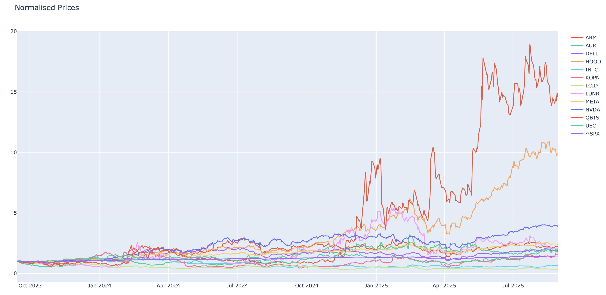
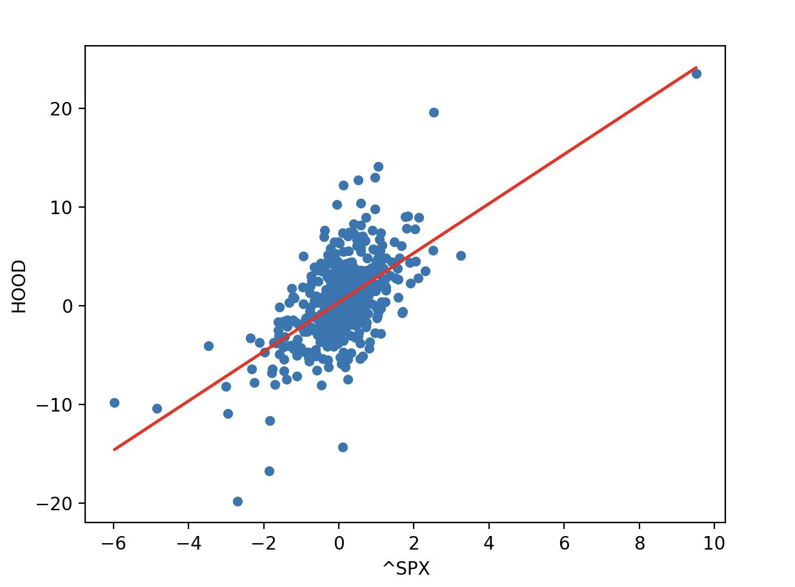

# Capital Asset Pricing Model (CAPM) Analysis  

This project applies the **Capital Asset Pricing Model (CAPM)** to a tech-heavy portfolio.  
It fetches stock data, calculates daily returns, computes beta & alpha, and estimates expected returns based on CAPM.  

---

## 📂 Project Structure  
- `Stock_data.csv` → Raw stock closing prices  
- `Stock_Daily_Returns.csv` → Daily return data  
- `CAPM_analysis.py` → Python script with functions and CAPM implementation  

---

## ⚙️ Setup  

### 1. Clone Repository  
Clone your GitHub repo to your local machine:

```bash
git clone https://github.com/Sanchay-01/Finance_Projects.git
cd Finance_Projects
````

### 2. Navigate to the CAPM Simulation Folder

```bash
cd "CAPM simulation"
```

### 3. Create Virtual Environment

```bash
python3 -m venv CAPM_env
source CAPM_env/bin/activate
```

### 4. Install Dependencies

```bash
pip install yfinance pandas numpy matplotlib plotly
```

---

## 📊 Workflow

### 1. Import Stock Data

We use Yahoo Finance (`yfinance`) to download stock prices for:
`HOOD, DELL, QBTS, AUR, KOPN, UEC, LCID, INTC, LUNR, ARM, NVDA, META, ^SPX`.


---

### 2. Normalize Prices

We normalize prices to compare performance across different stocks.📈



---

### 3. Daily Returns

We calculate daily returns as a percentage:

$$
R_t = \frac{P_t - P_{t-1}}{P_{t-1}} \times 100
$$

---

### 4. Beta and Alpha Estimation

We use **linear regression** against the S\&P 500 (`^SPX`) to compute:

* **Beta (β)** → stock volatility relative to the market
* **Alpha (α)** → excess return not explained by market movement

📈 Regression scatter plot for Robinhood as an example:


---

### 5. CAPM Formula

$$
E(R_i) = R_f + \beta_i (R_m - R_f)
$$

Where:

* $R_i$ = expected return of stock
* $R_f$ = risk-free rate (set as **4%**)
* $R_m$ = market return
* $\beta_i$ = stock’s beta

---

### 6. Portfolio Construction

We construct an **equally weighted portfolio** of 12 stocks and calculate expected portfolio return.

📊 Example output chart:


---

## 🚀 Future Work

* Add Sharpe ratio calculations
* Compare CAPM vs Fama-French 3-Factor model
* Automate backtesting of portfolio returns

---

## 📝 License

This project is open-source under the MIT License.


