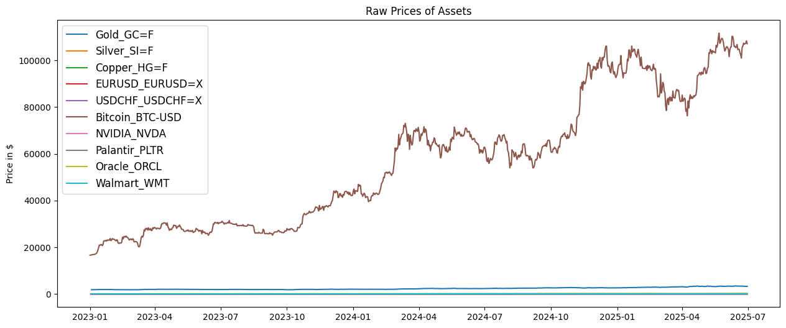
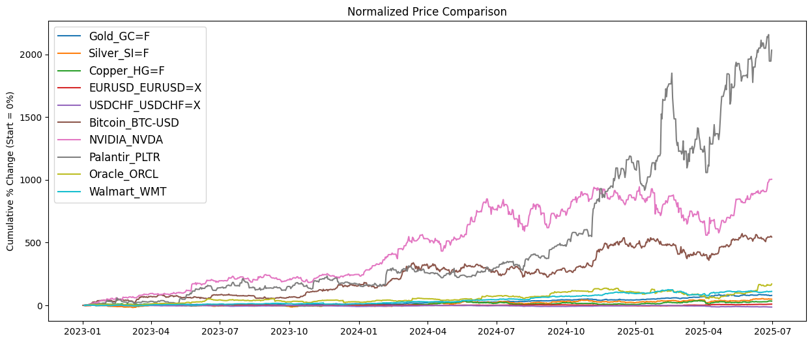
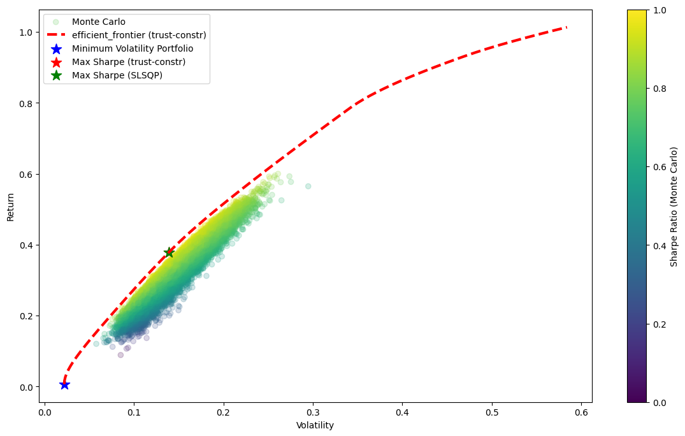
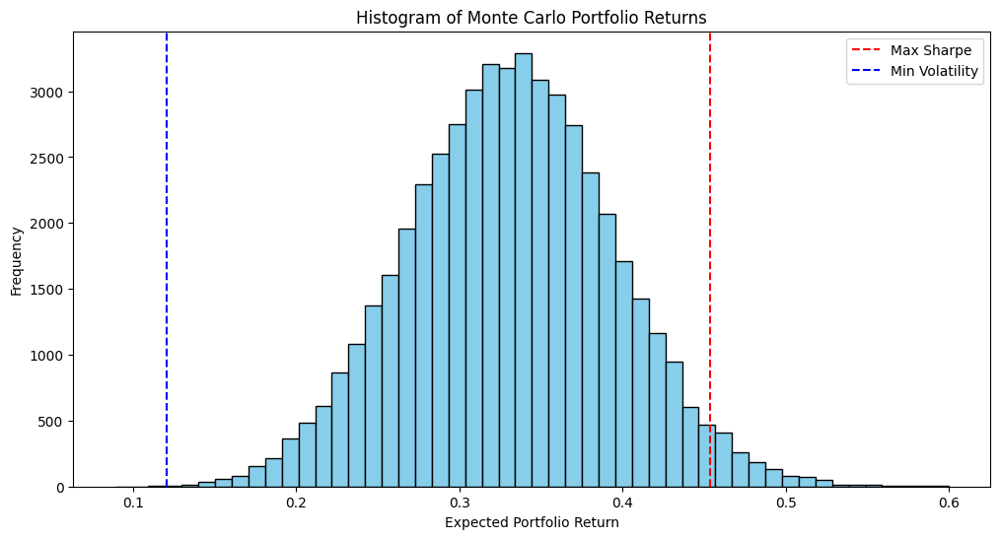

# **Cross-Asset Portfolio Optimization Project**

## **Overview**

This project demonstrates portfolio optimization using real historical data across multiple asset classes, including:

* **Commodities:** Gold, Silver, Copper
* **Forex Pairs:** EURUSD, USDCHF
* **Cryptocurrency:** Bitcoin
* **Stocks:** NVIDIA, Palantir, Oracle, Walmart

The main goal is to construct portfolios that either **minimize risk** or **maximize risk-adjusted return** (Sharpe ratio) and visualize the results using both deterministic optimization and Monte Carlo simulations.

---

## **Data Fetching and Preparation**

* **Source:** Yahoo Finance via `yfinance`
* **Period:** January 1, 2023 – July 1, 2025
* **Processing:**

  * Forward-fill missing data
  * Compute **daily returns**
  * Annualize returns and covariance matrices for portfolio calculations

---

## **Key Concepts**

### **Portfolio Return**

$$
R_p = \sum_{i=1}^{n} w_i R_i
$$

The weighted sum of expected annual returns of all assets, where $w_i$ is the portfolio weight.

### **Portfolio Volatility**

$$
\sigma_p = \sqrt{w^T \Sigma w}
$$

The portfolio standard deviation computed using the covariance matrix $\Sigma$ and weights $w$.

### **Sharpe Ratio**

$$
\text{Sharpe} = \frac{R_p - R_f}{\sigma_p}
$$

Measures **risk-adjusted return**, where $R_f$ is the risk-free rate. A higher Sharpe ratio indicates a more efficient portfolio.

---

## **Optimization Methods**

### 1. **Minimum Volatility Portfolio**

* Finds the portfolio weights that minimize total portfolio volatility under constraints (weights sum to 1, no short-selling).

### 2. **Maximum Sharpe Ratio Portfolio**

* Finds the portfolio that maximizes the Sharpe ratio.
* **Methods Used:**

  * `trust-constr` optimization
  * `SLSQP` (Sequential Least Squares Programming)

### 3. **Efficient Frontier**

* Plots the **risk-return trade-off** across a range of target returns.
* Helps visualize portfolios that offer the **lowest risk for a given return**.

---

## **Monte Carlo Simulation**

* Generates **50,000 random portfolios** with different weight combinations.
* Calculates **returns, volatility, and Sharpe ratio** for each.
* Plots a scatter of risk vs return, colored by Sharpe ratio.
* Allows comparison of random portfolios vs optimized portfolios.

---

## **Visualizations**

### **1. Raw Prices**

Shows the absolute historical prices of all assets.
*(Useful for understanding trends and volatility.)*


### **2. Normalized Prices**

Cumulative percentage changes from the start date, allowing comparison of relative performance across assets.


### **3. Efficient Frontier**

Red dashed line showing portfolios that minimize risk for a given return.

### **4. Monte Carlo Scatter**

* Red dashed line showing portfolios that minimize risk for a given return.
* Each point: a random portfolio
* Color: Sharpe ratio
* Highlights:

  * Minimum volatility portfolio (blue star)
  * Maximum Sharpe portfolio (`trust-constr`, red star)
  * Maximum Sharpe portfolio (`SLSQP`, green star)



### **5. Histogram of Monte Carlo Returns**

Shows the **distribution of portfolio returns**. Vertical lines indicate max Sharpe and min volatility portfolios.


---

## **Example Portfolio Outputs**

| Portfolio Type                | Return | Volatility | Key Assets (%)             |
| ----------------------------- | ------ | ---------- | -------------------------- |
| Minimum Volatility            | 0.0067 | 0.0221     | EURUSD: 50.6, USDCHF: 45.1  |
| Maximum Sharpe (trust-constr) | 0.3783 | 0.1390     | Gold: 42.5, WMT: 23.3  |
| Maximum Sharpe (SLSQP)        | 0.3780 | 0.1389     | BTC: 42.5, NVDA: 23.2  |


---

## **Key Learnings**

* Portfolio optimization balances **risk and return** across diverse assets.
* Commodities and forex pairs provide **stability**, while equities and cryptocurrencies add **higher potential returns but more volatility**.
* Monte Carlo simulations allow a **robust comparison** between optimized and random portfolios.
* Different optimization methods can yield slightly different weights but similar portfolio performance, showcasing **robustness in real-world scenarios**.

---

## **Dependencies**

```bash
pip install yfinance pandas numpy matplotlib scipy
```

---

## **Conclusion**

This project provides a **comprehensive portfolio optimization framework**:

* Real historical cross-asset data
* Multiple optimization strategies
* Monte Carlo simulations for stochastic analysis
* Insightful visualizations for decision-making


